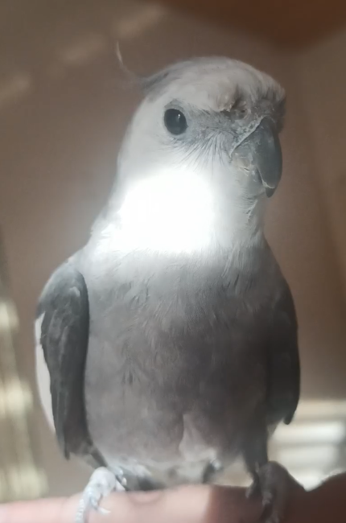

+++
title = "YouTube Vs. Blogging As A Game Developer"
description = """\
YouTube as a game developer feels like a trap. \
Is it worth it for me, or just a waste of time?\
"""
date = 2024-10-30
updated = 2024-12-05
draft = false

[taxonomies]
tags = ["Business", "Blog"]

[extra]
toc = false
giscus = true
+++

After clocking the 17th hour of working on my first YouTube video, I decided to
take a step back and began to question its value.

I want to talk about my thoughts about YouTube and content creation in general,
exploring my reasons for doing it in the first place, and why I ultimately
settled on blogging.

## Why I Want To Do YouTube

As a game developer, YouTube fascinates me.

It could become a career in itself, just a hobby for fun, a marketing device to
sell a product or service, a self-improvement or feedback tool, a plain video
storage and sharing platform, a social medium and networking tool or a
combination of these.

First, I need to understand what I even want to get out of a YouTube channel,
and how much I want to put in. This drives all the other decisions.

Right away, I want to state that I don't want to pursue it for any monetary or
marketing reasons.

There seems to exist some sort of common misconception, that devlogs would only
appeal to other developers, but I don't agree with this. A devlog can appeal to
whomever it should appeal. Nothing prevents you from targeting a "normal" viewer
with high level devlogs. A demand comparable to all the crafting, building and
engineering channels, just about game development instead, likely exists. Heck,
I once watched a video about some dudes forging a sword. People just like
watching experienced people creating things. 

That said, it requires naivety to think that I could succeed on YouTube or in game
development, when splitting my focus between them, given the competitive nature
of those fields. Even the people who focus on a single thing full-time struggle
to turn it into a viable business. I want to primarily focus on making my own
games, which leaves not enough room for another bottomless time-sink.

It reminded me of the wisdom of everyone's favorite human grumpy cat:

It makes no sense for me to do YouTube for any reason that requires many views,
because it highly correlates with the amount of time I have to put in, time that
I would rather directly put into the game. Maybe once my games become
profitable, I might consider spreading out, when I reach a state where I could
hire someone to do this for me, but I remain kinda doubtful about this.

At least for now, it makes more sense to make my game as good as possible, to
increase the odds of proper influencers picking it up. Even if I could magically
pull off a channel that gets one million views on their devlogs, this view count
should only amount to a fraction of the total views among all other influencers
in the best case. Getting a channel with hundreds of thousands of subscribers to
showcase my game feels far easier than building a channel with a hundred
thousand subscribers myself. Although the audience of my own channel might
display greater loyalty and convert better, one big influencer picking up my
game could create a snowball effect, leading to even more exposure.

This realization comes with a liberation: If I don't need views, I don't have to
please the almighty, ever-changing algorithm. I can focus solely on the content,
without any padding for mid-roll ads, spending dozens of hours on overly edited
videos to increase retention, resorting to clickbait or selling out to sponsors.
I can also talk about whatever I want, without having to appeal to a broad
audience.

### Doing YouTube As A Hobby

It makes more sense for me, to treat YouTube as a hobby, just for fun. The urge
to share opinions, to seek validation and to belong to a community, makes people
post on social media in the first place. YouTube as a medium has the potential
to make the content timeless, compared to an almost ephemeral tweet, which no
one will see again once it leaves the timeline. Well, at least if we ignore the
platform ownership issue, but more about that later.

It already seemed impossible to find people in "real life" who share a common
interest in tech or other nerd stuff, but since I started working from
home, the opportunities became even rarer. Posting about my interests scratches
this itch somewhat. I can share my passion and potentially connect with
like-minded people.

Running a YouTube channel also makes you learn useful skills, that can apply
outside the platform:

- gaining confidence in front of a camera
- improving script writing and storytelling
- getting valuable constructive feedback from others

This sounds fun!

### YouTube As Creative Outlet

YouTube can also feel cathartic, helping me with exploring my feelings and
thoughts. I already write down all my thoughts in local Markdown documents, but
YouTube videos could turn them into something more organized. Audio and visuals
can enrich the content as well.

Presenting a topic to someone else makes sure that you understand the topic in
the first place. If my topic covers my personal thoughts and opinions, YouTube
becomes a great tool to reflect on them, and I might even gain new insights from
this process. For example, helping me decide whether creating YouTube
devlogs make sense for me ;)

Documenting the journey of me trying to make my own game allows me to
essentially travel back in time later. I can remind myself of why and how I
decided to do certain things, get into the headspace at the time and to keep
track of the challenges and solutions along the way.

### Opportunities Through YouTube

YouTube can also help to open up many opportunities. You can connect with your
fellow content creators, or even collaborate with them. Your viewers might also
want to support you, either by contributing to the projects in different ways,
or by supporting you financially via Patreon.

Even with a low subscriber count, a loyal following can provide early feedback
on a demo, or help to reach the 10-reviews threshold on Steam to get a rating, which
in turn helps to kick off the organic traffic.

I could also just use my YouTube channel as an excuse to slide into the direct
messages of a developer to ask them questions that interest me personally. "Hey,
I run MyCoolChannel, and want to make a video about you and your game. Could you
help me with some questions that I have?" will make them more likely to respond
than a tweet by a random bloke, bothering them with a bunch of questions. It
might even turn into a full interview.

## Why I DON'T Want To Do YouTube

To fully realize whether YouTube makes sense for me, I must also take a look at
the reasons against it. As mentioned above, time does not really concern me,
since I don't aim to get any views, I can invest as little time as I want.
Talking directly into the camera with minimal editing appears as the current
trend among developers who release their own games consistently and treat
YouTube as a hobby. Managing this with 1-2 hours a week feels achievable.

### Lack Of Ownership

Building something on land that you don't own means that you never truly own it.
This also applies to YouTube, where not just my channel, but the whole platform
could disappear overnight.

This poses less of a problem for preservation, as I would probably create
backups for my videos, but the loss of subscribers would hurt a lot.
Years of work cultivating a following that would just evaporate.

You can see this on Twitter: Many people tried to move to alternatives like
Mastodon or Bluesky, but only ended up with a fraction of the original engagement.

You also have no control over changes to the algorithm, the UI, or video content
and format guidelines.

### Influence Of Analytics

Basic human psychology makes us repeat things that get positive feedback, and
avoid the things that bring us negative feedback. This means that YouTube could
easily bleed into the creation of the videos and even my games.

Polished visuals will result in better views than placeholder programmer art,
but the natural order in game development defers polishing for as long as
possible. Polishing stuff that might get thrown out will mean that I wasted my
time in the worst case.

This applies not just to the visuals, but also to the actual video topics, and
even code of the game. A "cool" algorithm makes a better video than just me
talking about how I refactored my code. I might even end up focusing on shipping
features instead of writing maintainable code, just to get the content for the
video out on time.

YouTube's algorithm hates technical niche content. A video about how I quit my
life as a vegan butcher to become a C++ programmer would get way more views than
a video on how to implement the Sutherland-Hodgman algorithm.

I don't care about views right now, but because of the  feedback through
analytics, I worry that my focus will shift towards views over time,
even if it happens subconsciously. Even worse than that, I could easily see
myself getting stressed out during the later stages of development, and having
YouTube tell me that people also started to "hate" my videos might break the final
straw for me, affecting my mental health in unforeseeable ways.

I could just not look at the analytics at all, but when I tried to do exactly that
earlier this year, when [I streamed game dev on Twitch for 2
weeks](https://sullygnome.com/channel/genusnymphicus/365), I realized that I
still occasionally took a peek in a moment of weakness. YouTube gets even more
in-your-face with the metrics, and places them all over the creator dashboard.

### Immutability Of Videos

Once you upload a video, you can't change it anymore. Well, in theory you could
take it down, do the changes, and then re-upload it, but not only will you annoy
subscribers, re-editing, rendering and uploading the video also takes hours,
which makes it unsuitable for quick edits.

This means that factual errors would keep spreading. It also means I can't
update the content with new data, let's say adding the first week's sales data
to the postmortem of my game. Maybe a few viewers add great points that I would
want to highlight in the video, etc.

This also affects educational videos the most: Instead of updating the video
when a programming library API changes, I would need to upload an entirely new
video.

## The Alternatives To YouTube

Alternatives to YouTube, that can mitigate some disadvantages, exist in
the form of streaming and blogging.

### Streaming

I already briefly mentioned streaming. While it doesn't really scratch the creative
itch, it also doesn't take any extra time to do. When I streamed earlier this
year, I did it while programming on my game. It didn't take long to have my
first regulars, with whom I talked about our shared interests. Whenever I got a
new follower, I used that opportunity to ask them about their projects, which
often resulted in some nice conversations.

The option to return to streaming has opened up again, but currently, I feel not
sure anymore. Getting into *the zone* seems impossible while streaming. Talking
through the current work at hand on didn't distract me directly, as I typically
just verbalized my inner thoughts. Unfortunately, smaller distractions, like
glancing at the chat or thoughts about the stream itself, asking myself if my
current work bores viewers, created enough interruptions to keep me from losing
myself in my work. The live aspect surely didn't help, because I focused on not
doing anything weird, like picking my nose, browsing social media, turning on a
cartoon, leaking anything too private or flashing my bum live on stream.

Having barely any experience with streaming contributed probably to this a lot,
and routine and familiarity might avoid this somewhat.

One potential solution could involve limiting streaming time and completing the
majority of the work off-stream.

### Blogging

Honestly, blogging didn't cross my mind at all at first. Blogging as a whole
seem not nearly as popular anymore, compared to 10-20 years ago.

When I visited [r/NewTubers](https://www.reddit.com/r/NewTubers/), to read
up on the whole How-To YouTube stuff, one post in particular stood out to me:
[YouTube isn't the only
way](https://www.reddit.com/r/NewTubers/comments/1eqnxdm/youtube_isnt_the_only_way/),
by Chris Zukowski, who has one of the most popular game development blogs: [How
To Market A Game](https://howtomarketagame.com/), where he talks about the
marketing side of indie game development.

While he aims his advice towards people who struggle with YouTube for years,
encouraging them to give blogging a try, it got me thinking: My reasons
for doing YouTube also apply to a classic blog. Blogs also don't have any of the
mentioned drawbacks, unless I pick any of the proprietary blogging platforms.

At first, I thought that the debate would shift to video vs. text content, but I
don't think that this makes a lot of sense. I can just pick the medium that fits
best and just self-host it on my blog. I can easily embed a video on my website,
if I really wanted to, if it fits the content I want to create.

Having "plain text" as a viable option opens up many advantages. Since text
works nicely with version control systems, preservation becomes really simple.
Updating and storing text files requires minimal effort, and they offer greater
portability, allowing me to create them almost anywhere. I can sit down and
write without dressing up, anywhere where I want, even in a noisy environment.

I appreciate this flexibility, given that my little 25-years old buddy can make
a lot of noise.

YouTube offers reach, and the ability to bring organic traffic through the
algorithm. Since I don't really care about massive viewer counts,
YouTube loses its biggest strength as a platform for me.

That said, blogs kinda sit on the opposite end and have basically almost no
discoverability. Readers have to go out of their week to actively seek out the
content. No "front page" or recommendations will guide them to my content.

I mentioned that a large follower count does not matter to me, but writing posts
that no one will read, nullifies some of the advantages. A blog requires some
extra effort to bring new readers to it, for example by using other social
media, including YouTube, which I might look into for some future quality or
milestone posts, for example, a post mortem for my games.

## Conclusion

Turns out that no compelling reasons push me to use YouTube, as a simple blog
can achieve the same goals, while offering some advantages. Owning the platform
fully, avoiding the trap of status-seeking, and maintaining complete flexibility
and independence, provide strong incentives.

